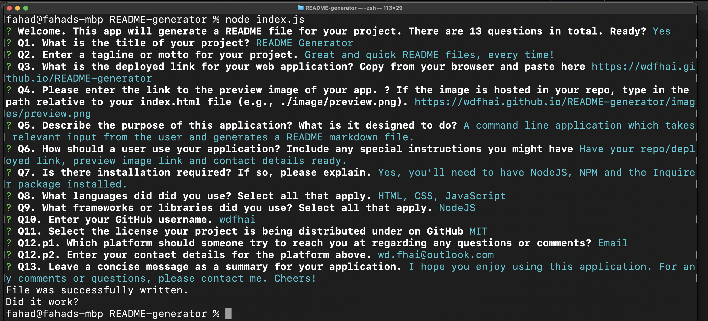

    <h3 align="center">README Generator</h3>
     
    

    Great READMEs, every time!
     
     
    <a href="https://github.com/wdfhai/README-generator">View Demo</a>
    

    
Table of Contents

    <ol>
        <li><a href="#about-the-project">Description</a></li>
        <li><a href="#built-with">Built With</a></li></li>
        <li><a href="#installation">Installation</a></li>
        <li><a href="#usage">Usage</a></li>
        <li><a href="#contributing">Contributing</a></li>
        <li><a href="#license">License</a></li>
        <li><a href="#contact">Contact</a></li>
        <li><a href="#summary">Summary</a></li>
    </ol>

### Description

This application is designed to receive input from the user regarding their project and then create a README markdown file for that project. In fact, this README is also generated by this application.

### Built With

Following languages, frameworks and libraries were used in the development of this project:

- HTML,CSS,JavaScript
- JQuery

### Installation

Yes, you'll need NodeJS, NPM, Inquirer and Chalk installed.

### Usage

Have your repo/deployed link, preview image link and contact details ready.

### Contributing

Contributions are what make the open source community such an amazing place to learn, inspire, and create. Any contributions you make are **greatly appreciated**.

1. Fork the Project
2. Create your Feature Branch
3. Commit your Changes
4. Push to the Branch
5. Open a Pull Request

### License

This project is using the following license: MIT

### Contact

- My Github name is wdfhai.
- For any questions or comments, please reach out to me on Email at wd.fhai@outlook.com.

### Summary

Thanks for checking out my project. I hope you enjoy using it. Cheers!
