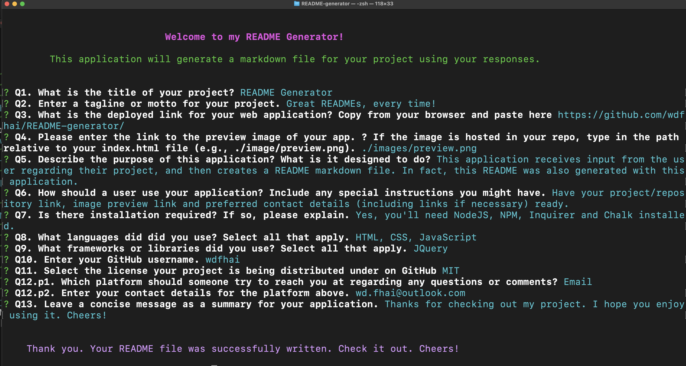

    <h3 align="center">README Generator</h3>
     
    

    Great READMEs, made easy!
     
     
    <a href="https://github.com/wdfhai/README-generator/">View Demo</a>
    

    
Table of Contents

    <ol>
        <li><a href="#about-the-project">Description</a></li>
        <li><a href="#built-with">Built With</a></li></li>
        <li><a href="#installation">Installation</a></li>
        <li><a href="#usage">Usage</a></li>
        <li><a href="#contributing">Contributing</a></li>
        <li><a href="#license">License</a></li>
        <li><a href="#contact">Contact</a></li>
        <li><a href="#summary">Summary</a></li>
    </ol>

### Description

This application is designed to take input from the user regarding their project and then generate a quality README markdown file with all the relevant information. In fact, this README was also generated through this application.

### Built With

Following languages, frameworks and libraries were used in the development of this project:

- HTML,CSS,JavaScript
- NodeJS

### Installation

Yes, you'll need NodeJS, NPM and NPM packages such as Inquirer and Chalk installed before running the application.

### Usage

Have your repo/project link, preview image link/path and your contact details ready. Once ready, type in node index.js from the correct directory to initialize the application.

### Contributing

Contributions are what make the open source community such an amazing place to learn, inspire, and create. Any contributions you make are **greatly appreciated**.

1. Fork the Project
2. Create your Feature Branch
3. Commit your Changes
4. Push to the Branch
5. Open a Pull Request

### License

This project is using the following license: MIT

### Contact

You can reach me for any questions or comments at the following:

- Look me up on Github,  where my username is <a href="https://github.com/wdfhai">wdfhai</a>.
- Reach out to me through email at wd.fhai@outlook.com.
- Find me on Twitter at https://twitter.com/wdfhai.

### Summary

Thanks for checking out my application. I hope you enjoy using it. Cheers!
